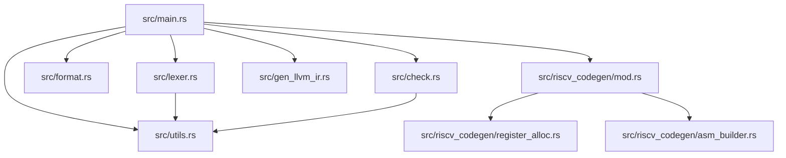
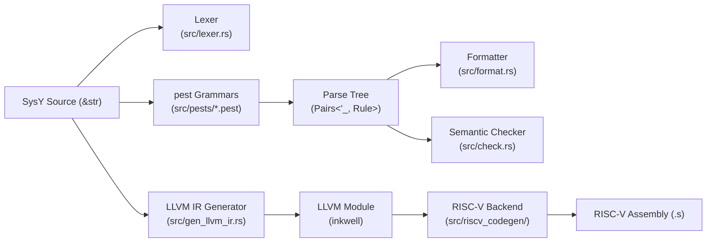

# Architecture Document

This document describes the architecture of the SysY→RISC-V compiler at commit `f5b8eb08d74b85cdf4c78c4ecfdae4880dcfeb1c`. It covers the module dependency graph, per-module responsibilities, explicit interface contracts, key design decisions, cross-cutting concerns, and known technical debt.

---

## 1. High-Level Architecture

### 1.1 Module Dependency Graph

The crate is a binary-only project (`src/main.rs` acts as the root). Modules and their internal dependencies are shown below.

**Dependency rationale** [EXEC-VERIFIED]:
- `src/main.rs` declares every sibling module with `mod` and drives subcommand dispatch.
- `src/lexer.rs` and `src/check.rs` both depend on `src/utils.rs` for `hex_to_int`, `oct_to_int`, and string helpers.
- `src/riscv_codegen/mod.rs` re-exports and depends on its two submodules: `register_alloc.rs` and `asm_builder.rs`.
- `src/format.rs`, `src/gen_llvm_ir.rs`, `src/riscv_codegen/asm_builder.rs`, and `src/utils.rs` have no internal crate dependencies.

### 1.2 Data-Flow Diagram

**Data-flow notes** [EXEC-VERIFIED]:
- The lexer, formatter, and semantic checker each consume the raw source string and produce their own `Pairs<'_, Rule>` via independent pest grammars.
- The LLVM IR generator (`Scanner`) also parses directly from the source string; it does not receive an AST from the checker.
- The RISC-V backend internally invokes `Scanner::scan_collect_asm` to obtain an LLVM `Module`, then walks that module to emit assembly.

---

## 2. Module Responsibilities

### 2.1 `src/main.rs`

The CLI entry point built with `clap`. It exposes five subcommands (`tokenize`, `fmt`, `check`, `gen-ir`, `gen-asm`) plus a backward-compatible positional-args fallback that defaults to `gen-asm` behavior. `main.rs` initializes `tklog` logging, reads the input file into a `String`, and dispatches to the appropriate module. Fatal errors (missing files, backend failures) emit to `stderr` and exit with code `1`. The module contains no compiler logic beyond dispatch and glue code. [EXEC-VERIFIED]

### 2.2 `src/lexer.rs`

Implements a pest-driven tokenizer. `ExpressionParser` (derived from `src/pests/lexer.pest`) parses the entire source file into `Pairs<'_, Rule>`, which are then flattened into `Vec<(usize, Token)>` via `From<Pair<'_, Rule>> for Token`. The six `Token` variants (`Identifier`, `Operator`, `Type`, `Flow`, `IntegerConst`, `ErrorSyntax`) cover all lexical categories. If `ErrorSyntax` tokens are present, only error diagnostics are emitted; otherwise the full token stream is printed. Hexadecimal and octal literals are converted to decimal display values using helpers from `src/utils.rs`. [EXEC-VERIFIED]

### 2.3 `src/format.rs`

A pretty-printer that operates directly on the `pest` parse tree produced by `FParser` (using `src/pests/parser.pest`). `Formatter` walks `Pair<Rule>` nodes recursively, applying 4-space indentation, control-flow body layout, array-dimension alignment, and semicolon-aware newline insertion. It does not build an explicit AST; formatting rules are encoded as side effects inside `Formatter::fmt`. After the walk, `clean_extra_blank_lines` normalizes redundant newlines while preserving a single blank line between function definitions. Syntax errors in the input produce `Error type A at Line N` lines and suppress formatted output. [EXEC-VERIFIED]

### 2.4 `src/check.rs`

The semantic analysis engine. `Checker::syn_check` parses the source with `CParser` (`src/pests/check.pest`) and walks the resulting tree to enforce scoping and type rules. It maintains a `ScopeStack` (global → function → inner blocks) and collects 11 categories of semantic errors (`UndefinedVal`, `TypeMismatch`, `ReturnMismatch`, etc.). Symbol tables are split per-scope; functions are stored as `Type::Func`, variables as `Type::Int`, and arrays as `Type::Array`. Expression type checking is bottom-up: arithmetic operators require `Int` operands, array subscripts require `Array` receivers, and function calls validate argument counts and types against the callee signature. [EXEC-VERIFIED]

### 2.5 `src/gen_llvm_ir.rs`

The LLVM IR generator. `Scanner` parses the source with its own `CParser` (`src/pests/scan.pest`) and lowers directly to LLVM instructions via `inkwell`. It creates an `IrSession` bundling `Context`, `Module`, `Builder`, and a scope stack. Globals are emitted as `GlobalValue` or `alloca`+`store`; functions are declared, parameters are spilled to stack slots, and bodies are emitted as basic blocks with terminators. Control flow (`if`, `while`, `&&`, `||`) is lowered to explicit branch instructions and phi-free block-level jumps. All integer types are hard-coded to `i32`. The module verifies the result with `module.verify()` before printing to file. [EXEC-VERIFIED]

### 2.6 `src/riscv_codegen/mod.rs`

The RISC-V backend driver. `generate_asm` orchestrates a two-phase pipeline per function. **Pass 1** (`FunctionState`) collects def/use information, records basic-block boundaries, detects backward branches (loops), and computes liveness intervals. **Pass 2** emits `.text`, `.globl`, function labels, prologue/epilogue, and dispatches each LLVM instruction to a generator via `generate_instruction`. Supported opcodes include `Add`, `Sub`, `Mul`, `SDiv`, `SRem`, `ICmp`, `Load`, `Store`, `Br`, `ZExt`, and `Return`. The backend consumes the LLVM `Module` as its only intermediate representation. [EXEC-VERIFIED]

### 2.7 `src/riscv_codegen/register_alloc.rs`

Implements linear-scan register allocation with spill-to-stack. `LinearScan::allocate` sorts `InnerVar` live intervals by start offset, then greedily assigns registers from a priority-ordered pool (`t3`–`t6`, then `s0`–`s11`, then `a2`–`a7`). When the pool is exhausted, `overflow_to_stack` applies a spill-farthest heuristic: if an active variable ends later than the current variable, that active variable is spilled; otherwise the current variable is spilled directly. Spilled variables receive negative stack offsets that are later converted to positive offsets relative to the frame bottom. A `NoAlloc` fallback places every variable on the stack. `t0`–`t2` are reserved as scratch registers and are never allocated to user SSA values. [EXEC-VERIFIED]

### 2.8 `src/riscv_codegen/asm_builder.rs`

A thin string-buffer wrapper that emits formatted RISC-V assembly text. `AsmBuilder` provides methods for every directive and pseudo-instruction used by the backend: section directives (`.text`, `.data`), symbol directives (`.globl`, `.word`), function frame helpers (`emit_function_prologue`, `emit_function_epilogue`, `emit_exit_syscall`), ALU operations (`emit_add`, `emit_sub`, `emit_mul`, `emit_div`, `emit_rem`), memory operations (`emit_lw`, `emit_sw`), branches (`emit_beq`, `emit_bne`, `emit_blt`, `emit_bgt`, `emit_ble`, `emit_bge`), compares (`emit_slt`, `emit_sgt`, `emit_seqz`, `emit_snez`, `emit_sle`, `emit_sge`), jumps (`emit_j`, `emit_jal`, `emit_jr`), moves (`emit_mv`), and system calls (`emit_ecall`, `emit_syscall`). `AsmBuilder::emit()` returns the accumulated `String`. [EXEC-VERIFIED]

### 2.9 `src/utils.rs`

Small utility helpers for radix conversion and string operations. `hex_to_int` and `oct_to_int` use `num_bigint::BigInt` to safely parse hexadecimal and octal literals before truncation to `i32`, preventing overflow during lexical analysis. `add_option_string` and `eq_option_string` provide conveniences used by the semantic checker. The module has no external dependencies beyond `num-bigint` and `num-traits`. [EXEC-VERIFIED]

---

## 3. Interface Contracts

This section documents the five explicit boundaries between compiler phases. Each contract is cross-referenced against the Contract Coverage Matrix in `docs/steel_thread_trace.md`.

### 3.1 Parser → AST

**Coverage:** `[EXEC-VERIFIED]`

The compiler does not construct a hand-written abstract syntax tree. Instead, every frontend stage consumes `pest::iterators::Pairs<'_, Rule>` — a concrete parse tree produced by one of four pest grammars (`src/pests/lexer.pest`, `src/pests/parser.pest`, `src/pests/check.pest`, `src/pests/scan.pest`).

- `src/lexer.rs`: `ExpressionParser` produces `Pairs<'_, Rule>` and flattens them into `Token` values.
- `src/format.rs`: `FParser` produces `Pairs<'_, Rule>` that `Formatter::fmt` walks directly.
- `src/check.rs`: `CParser` produces `Pairs<'_, Rule>` that `Checker::syn_check` traverses recursively.
- `src/gen_llvm_ir.rs`: `CParser` (a separate struct with the same name, using `scan.pest`) produces `Pairs<'_, Rule>` for `Scanner`.

Because each stage owns its parser instance and grammar file, there is no unified AST type shared across the pipeline. [EXEC-VERIFIED]

### 3.2 AST → Semantic Checker

**Coverage:** `[EXEC-VERIFIED]`

`Checker::syn_check` accepts a raw source `&str` and an `io::Write` sink for diagnostics. Internally it invokes `CParser::parse(Rule::File, input)` to obtain the parse tree, then drives `analyze_declaration` for each top-level construct.

**Error reporting contract:**
- Errors are accumulated in `Checker::errors: Vec<SemanticError>`.
- Each `SemanticError` carries an `ErrorKind`, a line number, and a message.
- After the walk completes, `generate_error_output` flushes all errors in source order to the provided writer.
- If parsing fails outright, a single `Syntax error` line is emitted and no semantic analysis runs.
- Empty output from the checker means the program is semantically valid.

The checker exercises the full scope-stack lifecycle (`push`/`pop`) and validates all 11 error categories. [EXEC-VERIFIED]

### 3.3 Checker → IR

> ⚠️ Not execution-verified; inferred from static analysis. See Known Debt.

**Coverage:** `[STATIC-INFERRED]`

There is no direct data-flow contract between `Checker` and the LLVM IR generator. `Scanner::scan_collect` and `Scanner::scan_collect_asm` both accept a raw `&str` and independently re-parse the source with `src/pests/scan.pest`; they never consume the checker's `ScopeStack`, `Vec<SemanticError>`, or any other output artifact.

**Implied type guarantees:**
- The IR generator assumes the source has already passed semantic analysis. It does not emit user-facing diagnostics for type errors or undefined symbols. [STATIC-INFERRED]
- SSA form is constructed by `inkwell` via `Builder` calls (`build_alloca`, `build_store`, `build_load`, `build_int_add`, etc.). The generator itself does not perform SSA validation. [STATIC-INFERRED]
- There is no intermediate typed-AST or typed-IR boundary; the generator re-derives type information from parse-tree shape (e.g., `Rule::Int` vs. `Rule::Void`). [STATIC-INFERRED]

**Technical debt:** Because the checker and IR generator do not share symbol tables or type information, any grammar drift between `check.pest` and `scan.pest` can cause the IR generator to miscompile programs that passed semantic analysis. This is flagged explicitly in Known Debt.

### 3.4 IR → RISC-V Gen

**Coverage:** `[EXEC-VERIFIED]`

`generate_asm` in `src/riscv_codegen/mod.rs` first calls `Scanner::scan_collect_asm` to produce an `IrSession` containing an `inkwell::module::Module`. It then walks the LLVM module directly.

**Instruction selection boundaries:**
- Globals are extracted via `module.get_global_values()` and emitted as `.data` words by `build_global_variable`.
- Functions are extracted via `module.get_functions()` and processed by `build_function`.
- Within each function, basic blocks are iterated in order; instructions are dispatched by `InstructionOpcode` in `generate_instruction`.
- Supported opcodes: `Add`, `Sub`, `Mul`, `SDiv`, `SRem`, `ICmp`, `Load`, `Store`, `Br`, `ZExt`, `Return`. [EXEC-VERIFIED]
- Unknown opcodes are silently skipped rather than panicking. [EXEC-VERIFIED]

**Register allocation boundary:**
- After Pass 1 computes liveness, `AllocatedInnerVar` chooses between `NoAlloc` (pure stack) and `LinearScan` (register + spill).
- The resulting `HashMap<String, Location>` maps SSA value names to `Location::Reg`, `Location::Stack`, or `Location::Global`.
- `t0`–`t2` are reserved as temporaries for operand loading and are never assigned to user variables. [STATIC-INFERRED]

**Assembly emission boundary:**
- Pass 2 appends instructions to `AsmBuilder`, a plain `String` buffer.
- `AsmBuilder::emit()` yields the final `.s` file contents.

### 3.5 ABI / Calling Convention

> ⚠️ Not execution-verified; inferred from static analysis. See Known Debt.

**Coverage:** `[PARTIAL]`

The steel-thread trace only exercised `main()` with no parameters and no callees. Consequently, the full calling convention is not validated at runtime. The following conventions are inferred from the implementation.

**Stack frame layout:**
- Prologue: `addi sp, sp, -N` where `N` is the frame size aligned to 16 bytes. [EXEC-VERIFIED]
- Epilogue: `addi sp, sp, N` followed by the exit syscall (`li a7, 93; ecall`). [EXEC-VERIFIED]
- Local variables and spilled temporaries live at negative offsets from `sp` during allocation, then are converted to positive offsets for emission. [EXEC-VERIFIED]

**Register usage conventions:**
- `a0` is reserved for the return value; `a1` is reserved and not allocated to user variables. [STATIC-INFERRED]
- `a2`–`a7` are part of the allocator pool but are used after temporaries and saved registers. [EXEC-VERIFIED]
- `s0`–`s11` are pooled for longer-lived values. [EXEC-VERIFIED]
- `t3`–`t6` are preferred for short-lived temporaries. [EXEC-VERIFIED]
- `t0`–`t2` are scratch registers for operand loading and result staging. [STATIC-INFERRED]

**Parameter passing:**
- LLVM IR generation lowers parameters to stack `alloca` slots via `build_alloca` + `build_store`. [EXEC-VERIFIED]
- The RISC-V backend does not implement the LLVM `Call` opcode; therefore register-based argument passing and caller-saved register saving/restoring around calls are unimplemented. [STATIC-INFERRED]
- Return from `main()` loads the result into `a0`, restores `sp`, and triggers the exit syscall. [EXEC-VERIFIED]

---

## 4. Key Architecture Decisions

### 4.1 Why pest for Parsing

All syntactic analysis stages use pest PEG grammars rather than hand-written recursive-descent lexers or parsers. This decision prioritizes maintainability for an educational compiler with five distinct pipeline stages (tokenize, format, check, gen-ir, gen-asm). Each stage owns a small `.pest` file that can be evolved independently. The trade-off is that there is no shared AST; each stage re-parses from the source string. [EXEC-VERIFIED]

### 4.2 Why inkwell for LLVM IR

The project uses `inkwell` (safe Rust bindings over the LLVM-C API) to construct SSA-form IR, basic blocks, and instructions programmatically. This avoids the fragility of string concatenation for IR text and gives the project free access to LLVM's built-in verifier and pretty-printer. The `llvm14-0` feature pin ensures reproducibility against a single LLVM version. [EXEC-VERIFIED]

### 4.3 Why Linear Scan for Register Allocation

The RISC-V backend implements linear-scan allocation because it is simple to implement, fast at compile time, and sufficient for the SysY teaching subset. The allocator sorts live intervals once and makes a single left-to-right pass, spilling when the physical register pool (`t3`–`t6`, `s0`–`s11`, `a2`–`a7`) is exhausted. A spill-farthest heuristic attempts to minimize reload traffic by evicting the interval that ends latest. The `NoAlloc` fallback provides a baseline for testing correctness without register pressure. [EXEC-VERIFIED]

### 4.4 Why AsmBuilder for Assembly Emission

`AsmBuilder` encapsulates every RISC-V directive and pseudo-instruction behind a typed method (`emit_add`, `emit_lw`, etc.). This isolates string-formatting details (registers, immediates, offsets) in one place and makes the backend code in `riscv_codegen/mod.rs` read like an instruction selector rather than a string builder. It also simplifies testing: `AsmBuilder::emit()` returns a plain `String` that can be asserted against baselines. [EXEC-VERIFIED]

---

## 5. Cross-Cutting Concerns

### 5.1 Logging

The `gen-asm` subcommand initializes `tklog` via `log_init()` in `src/main.rs`. `tklog::LOG` is configured with console output, level `Info`, and a formatter that includes level, time, short file name, and message. `tklog` is used primarily in the RISC-V backend for development-time trace output. The lexer, formatter, and checker do not use structured logging; they write directly to `stderr` or the provided `io::Write` sink. [EXEC-VERIFIED]

### 5.2 Error Handling Strategy

Error handling varies by pipeline stage:
- **Lexer / Formatter:** Syntax errors are swallowed or emitted as error-token diagnostics; the command returns silently if parsing fails entirely. [EXEC-VERIFIED]
- **Semantic Checker:** Errors are collected into a `Vec` and flushed after the full tree walk so that multiple diagnostics are reported in one pass. [EXEC-VERIFIED]
- **LLVM IR / RISC-V:** These stages return `Result<(), String>` and propagate failures upward to `main.rs`, which prints `编译错误: …` and exits with code `1`. They do not produce user-facing diagnostics for semantic errors. [EXEC-VERIFIED]
- **CLI:** File-read failures call `eprintln!` followed by `std::process::exit(1)`. [EXEC-VERIFIED]

### 5.3 Memory Management Approach

The compiler follows Rust's ownership model throughout. The only significant unmanaged resource is the LLVM `Context`, which is owned by `IrCore` and borrowed by `IrSession`. `inkwell` ties LLVM object lifetimes to the `Context` lifetime, so `IrSession` carries a `<'ctx>` parameter. All other data structures (`ScopeStack`, `Checker`, `FunctionState`, `LinearScan`) are stack-allocated or heap-allocated via `Vec`/`HashMap` and dropped normally. There is no custom allocator or garbage collector. [EXEC-VERIFIED]

---

## 6. Known Debt

### 6.1 Oversized Modules

| File | Lines | Concern |
|------|-------|---------|
| `src/gen_llvm_ir.rs` | 2,250 | Mixes parsing, scope management, type derivation, control-flow lowering, and LLVM emission in one file. |
| `src/check.rs` | 1,621 | Semantic analysis, symbol tables, error formatting, and 11 error-category checks all inline. |
| `src/riscv_codegen/mod.rs` | 2,069 | Contains liveness analysis, loop detection, register-allocation orchestration, and per-opcode instruction selection. |

These modules exceed the typical 500–800 line target for single-responsibility files. Refactoring would involve extracting parsers, scope stacks, and opcode tables into smaller submodules. [EXEC-VERIFIED]

### 6.2 Tight Coupling Between Checker and IR Generator

There is no shared AST or typed-IR boundary. Both `src/check.rs` and `src/gen_llvm_ir.rs` maintain independent `CParser` instances (`check.pest` and `scan.pest`) and independently traverse `Pair` trees. Type information computed during semantic analysis is discarded; IR generation re-derives everything from parse-tree shape. Grammar changes must be kept in sync manually. [EXEC-VERIFIED]

### 6.3 Missing `lib.rs` / Pure Binary Limitation

The crate has no `lib.rs`; all modules are declared in `src/main.rs`. This means:
- The compiler cannot be consumed as a library crate. [EXEC-VERIFIED]
- Integration tests in `tests/` must shell out to the compiled binary (`env!("CARGO_BIN_EXE_compiler")`) rather than linking against a library API. [EXEC-VERIFIED]
- Internal unit tests are scattered inside `#[cfg(test)]` blocks in each source file. [EXEC-VERIFIED]

### 6.4 Four Separate pest Grammars vs. Shared AST

The project maintains four distinct `.pest` files (`lexer.pest`, `parser.pest`, `check.pest`, `scan.pest`) instead of a single grammar and a shared AST. This redundancy increases maintenance cost and raises the risk of grammar drift. [EXEC-VERIFIED]

### 6.5 Unimplemented Backend Features

The RISC-V backend does not handle the LLVM `Call` opcode. Consequently, SysY programs containing user-defined function calls (other than `main`) cannot be compiled to assembly by the current backend, even though the semantic checker and LLVM IR generator both support calls. `AsmBuilder` defines `emit_jal` and `emit_jr`, but they are unused in the instruction selector. [STATIC-INFERRED]

### 6.6 Hard-Coded Types and Reserved Registers

- `gen_llvm_ir.rs` hard-codes `i32` as the only integer type. SysY `float` is tokenized by the lexer but never lowered. [EXEC-VERIFIED]
- `LinearScan` reserves `t0`–`t2` as scratch registers, reducing the effective register pool by three temporaries. [STATIC-INFERRED]
- `AsmBuilder::emit_subi` emits a pseudo-instruction that may not be accepted by all RISC-V assemblers; it is currently unused in generated code. [STATIC-INFERRED]

---

*Document generated for commit `f5b8eb08d74b85cdf4c78c4ecfdae4880dcfeb1c`.*
