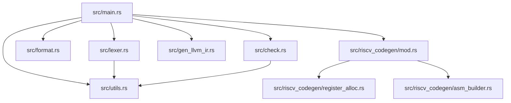
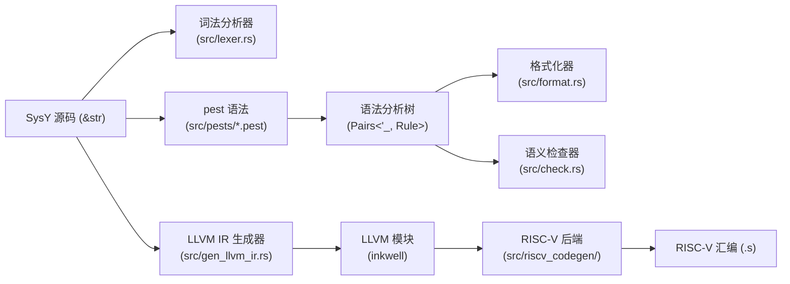

# 架构文档

本文档描述提交 `f5b8eb08d74b85cdf4c78c4ecfdae4880dcfeb1c` 处 SysY→RISC-V 编译器的架构。内容涵盖模块依赖图、各模块职责、显式接口契约、关键设计决策、横切关注点以及已知技术债务。

---

## 1. 高层架构

### 1.1 模块依赖图

本项目为纯二进制 crate（`src/main.rs` 作为根节点）。各模块及其内部依赖关系如下所示。

**依赖说明** [EXEC-VERIFIED]：
- `src/main.rs` 通过 `mod` 声明所有同级模块，并驱动子命令分发。
- `src/lexer.rs` 与 `src/check.rs` 均依赖 `src/utils.rs` 提供的 `hex_to_int`、`oct_to_int` 及字符串辅助函数。
- `src/riscv_codegen/mod.rs` 重新导出并依赖其两个子模块：`register_alloc.rs` 与 `asm_builder.rs`。
- `src/format.rs`、`src/gen_llvm_ir.rs`、`src/riscv_codegen/asm_builder.rs` 与 `src/utils.rs` 无内部 crate 依赖。

### 1.2 数据流图

**数据流说明** [EXEC-VERIFIED]：
- 词法分析器、格式化器与语义检查器均直接消费原始源码字符串，并通过独立的 pest 语法生成各自的 `Pairs<'_, Rule>`。
- LLVM IR 生成器（`Scanner`）亦直接从源码字符串进行解析；它不接收来自语义检查器的抽象语法树（Abstract Syntax Tree, AST）。
- RISC-V 后端在内部调用 `Scanner::scan_collect_asm` 获取 LLVM `Module`，随后遍历该模块以输出汇编代码。

---

## 2. 模块职责

### 2.1 `src/main.rs`

基于 `clap` 构建的命令行入口。暴露五个子命令（`tokenize`、`fmt`、`check`、`gen-ir`、`gen-asm`）以及一个向后兼容的位置参数回退，默认行为为 `gen-asm`。`main.rs` 初始化 `tklog` 日志，将输入文件读入 `String`，并分发到对应模块。致命错误（如文件缺失、后端失败）输出到 `stderr` 并以返回码 `1` 退出。该模块除分发与胶水代码外，不包含编译器逻辑。[EXEC-VERIFIED]

### 2.2 `src/lexer.rs`

实现基于 pest 驱动的词法分析器（tokenizer）。`ExpressionParser`（派生自 `src/pests/lexer.pest`）将整个源文件解析为 `Pairs<'_, Rule>`，再通过 `From<Pair<'_, Rule>> for Token` 将其扁平化为 `Vec<(usize, Token)>`。六个 `Token` 变体（`Identifier`、`Operator`、`Type`、`Flow`、`IntegerConst`、`ErrorSyntax`）覆盖所有词法类别。若存在 `ErrorSyntax` 词元，仅输出错误诊断；否则打印完整词元流。十六进制与八进制字面量通过 `src/utils.rs` 的辅助函数转换为十进制显示值。[EXEC-VERIFIED]

### 2.3 `src/format.rs`

一个直接作用于 pest 解析树的 pretty-printer，解析树由 `FParser`（使用 `src/pests/parser.pest`）生成。`Formatter` 递归遍历 `Pair<Rule>` 节点，应用 4 空格缩进、控制流体布局、数组维度对齐及分号感知换行。它不显式构建 AST；格式化规则以 `Formatter::fmt` 内部副作用的形式编码。遍历结束后，`clean_extra_blank_lines` 归一化冗余空行，同时在函数定义之间保留单个空行。输入中的语法错误产生 `Error type A at Line N` 行并抑制格式化输出。[EXEC-VERIFIED]

### 2.4 `src/check.rs`

语义分析引擎。`Checker::syn_check` 使用 `CParser`（`src/pests/check.pest`）解析源码并遍历生成的树，以强制执行作用域与类型规则。它维护一个 `ScopeStack`（全局 → 函数 → 内部块），并收集 11 类语义错误（`UndefinedVal`、`TypeMismatch`、`ReturnMismatch` 等）。符号表按作用域拆分；函数存储为 `Type::Func`，变量存储为 `Type::Int`，数组存储为 `Type::Array`。表达式类型检查采用自底向上方式：算术运算符要求 `Int` 操作数，数组下标要求 `Array` 接收器，函数调用则依据被调用者签名验证参数数量与类型。[EXEC-VERIFIED]

### 2.5 `src/gen_llvm_ir.rs`

LLVM IR 生成器。`Scanner` 使用自身的 `CParser`（`src/pests/scan.pest`）解析源码，并通过 `inkwell` 直接降级为 LLVM 指令。它创建一个 `IrSession`，打包 `Context`、`Module`、`Builder` 以及作用域栈。全局变量以 `GlobalValue` 或 `alloca`+`store` 的形式发出；函数被声明、参数被溢出到栈槽，函数体则以带有终结符的基本块形式发出。控制流（`if`、`while`、`&&`、`||`）被降级为显式分支指令及无 phi 节点的块级跳转。所有整数类型硬编码为 `i32`。模块在输出到文件前通过 `module.verify()` 进行验证。[EXEC-VERIFIED]

### 2.6 `src/riscv_codegen/mod.rs`

RISC-V 后端驱动器。`generate_asm` 按函数编排两阶段流水线。**阶段一**（`FunctionState`）收集 def/use 信息、记录基本块边界、检测反向分支（循环）并计算活跃区间。**阶段二** 发出 `.text`、`.globl`、函数标签、前言/尾声，并通过 `generate_instruction` 将每条 LLVM 指令分发到对应的生成器。支持的操作码包括 `Add`、`Sub`、`Mul`、`SDiv`、`SRem`、`ICmp`、`Load`、`Store`、`Br`、`ZExt` 与 `Return`。后端仅以 LLVM `Module` 作为其中间表示（Intermediate Representation, IR）。[EXEC-VERIFIED]

### 2.7 `src/riscv_codegen/register_alloc.rs`

实现线性扫描（linear scan）寄存器分配，并支持溢出到栈（spill-to-stack）。`LinearScan::allocate` 按起始偏移量对 `InnerVar` 活跃区间排序，然后从优先级排序的寄存器池（`t3`–`t6`，随后 `s0`–`s11`，再随后 `a2`–`a7`）中贪心分配寄存器。当寄存器池耗尽时，`overflow_to_stack` 采用最远溢出（spill-farthest）启发式策略：若某个活跃变量的结束位置晚于当前变量，则将该活跃变量溢出；否则直接溢出当前变量。被溢出的变量获得负栈偏移，随后被转换为相对于栈底的正偏移。`NoAlloc` 回退策略将所有变量置于栈上。`t0`–`t2` 被保留为临时寄存器（scratch registers），从不分配给用户 SSA 值。[EXEC-VERIFIED]

### 2.8 `src/riscv_codegen/asm_builder.rs`

一个薄字符串缓冲区包装器，用于输出格式化的 RISC-V 汇编文本。`AsmBuilder` 为后端使用的每条指令和伪指令提供方法：段指令（`.text`、`.data`）、符号指令（`.globl`、`.word`）、函数帧辅助（`emit_function_prologue`、`emit_function_epilogue`、`emit_exit_syscall`）、ALU 操作（`emit_add`、`emit_sub`、`emit_mul`、`emit_div`、`emit_rem`）、内存操作（`emit_lw`、`emit_sw`）、分支（`emit_beq`、`emit_bne`、`emit_blt`、`emit_bgt`、`emit_ble`、`emit_bge`）、比较（`emit_slt`、`emit_sgt`、`emit_seqz`、`emit_snez`、`emit_sle`、`emit_sge`）、跳转（`emit_j`、`emit_jal`、`emit_jr`）、移动（`emit_mv`）以及系统调用（`emit_ecall`、`emit_syscall`）。`AsmBuilder::emit()` 返回累积的 `String`。[EXEC-VERIFIED]

### 2.9 `src/utils.rs`

用于进制转换与字符串操作的小型辅助工具。`hex_to_int` 与 `oct_to_int` 使用 `num_bigint::BigInt` 在截断到 `i32` 之前安全地解析十六进制与八进制字面量，以防止词法分析期间发生溢出。`add_option_string` 与 `eq_option_string` 为语义检查器提供便利。该模块除 `num-bigint` 与 `num-traits` 外无其他外部依赖。[EXEC-VERIFIED]

---

## 3. 接口契约

本节记录编译器各阶段之间的五个显式边界。每个契约均与 `docs/steel_thread_trace.md` 中的契约覆盖矩阵交叉引用。

### 3.1 解析器 → 抽象语法树

**覆盖范围：** `[EXEC-VERIFIED]`

该编译器不构建手写抽象语法树（Abstract Syntax Tree, AST）。相反，每个前端阶段均消费 `pest::iterators::Pairs<'_, Rule>` —— 这是由四种 pest 语法之一（`src/pests/lexer.pest`、`src/pests/parser.pest`、`src/pests/check.pest`、`src/pests/scan.pest`）生成的具体解析树。

- `src/lexer.rs`：`ExpressionParser` 生成 `Pairs<'_, Rule>` 并将其扁平化为 `Token` 值。
- `src/format.rs`：`FParser` 生成 `Pairs<'_, Rule>`，由 `Formatter::fmt` 直接遍历。
- `src/check.rs`：`CParser` 生成 `Pairs<'_, Rule>`，由 `Checker::syn_check` 递归遍历。
- `src/gen_llvm_ir.rs`：`CParser`（一个同名但独立的结构体，使用 `scan.pest`）生成 `Pairs<'_, Rule>` 供 `Scanner` 使用。

由于每个阶段拥有自己的解析器实例与语法文件，流水线中不存在统一的 AST 类型。[EXEC-VERIFIED]

### 3.2 抽象语法树 → 语义检查器

**覆盖范围：** `[EXEC-VERIFIED]`

`Checker::syn_check` 接受原始源码 `&str` 以及一个用于诊断输出的 `io::Write` 接收器。内部调用 `CParser::parse(Rule::File, input)` 获取解析树，随后为每个顶层结构驱动 `analyze_declaration`。

**错误报告契约：**
- 错误累积在 `Checker::errors: Vec<SemanticError>` 中。
- 每个 `SemanticError` 携带一个 `ErrorKind`、行号和消息。
- 遍历完成后，`generate_error_output` 按源码顺序将所有错误刷新到提供的写入器。
- 若解析完全失败，则输出单行 `Syntax error` 且不再执行语义分析。
- 检查器空输出表示程序在语义上有效。

检查器执行完整的作用域栈生命周期（`push`/`pop`）并验证全部 11 类错误。[EXEC-VERIFIED]

### 3.3 检查器 → 中间表示

> ⚠️ 未经执行验证；基于静态分析推断。参见已知债务。

**覆盖范围：** `[STATIC-INFERRED]`

`Checker` 与 LLVM IR 生成器之间不存在直接的数据流契约。`Scanner::scan_collect` 与 `Scanner::scan_collect_asm` 均接受原始 `&str` 并使用 `src/pests/scan.pest` 独立重新解析源码；它们从不消费检查器的 `ScopeStack`、`Vec<SemanticError>` 或任何其他输出产物。

**隐式类型保证：**
- IR 生成器假定源码已通过语义分析。它不会为类型错误或未定义符号输出用户可见的诊断信息。[STATIC-INFERRED]
- 静态单赋值形式（Static Single Assignment, SSA）由 `inkwell` 通过 `Builder` 调用（`build_alloca`、`build_store`、`build_load`、`build_int_add` 等）构建。生成器本身不执行 SSA 验证。[STATIC-INFERRED]
- 不存在中间类型化 AST 或类型化 IR 边界；生成器从解析树形状重新推导类型信息（例如 `Rule::Int` 与 `Rule::Void`）。[STATIC-INFERRED]

**技术债务：** 由于检查器与 IR 生成器不共享符号表或类型信息，`check.pest` 与 `scan.pest` 之间的任何语法漂移都可能导致 IR 生成器错误编译那些已通过语义分析的程序。此问题在已知债务中已明确标出。

### 3.4 中间表示 → RISC-V 生成

**覆盖范围：** `[EXEC-VERIFIED]`

`src/riscv_codegen/mod.rs` 中的 `generate_asm` 首先调用 `Scanner::scan_collect_asm` 生成包含 `inkwell::module::Module` 的 `IrSession`，随后直接遍历该 LLVM 模块。

**指令选择边界：**
- 全局变量通过 `module.get_global_values()` 提取，并由 `build_global_variable` 以 `.data` 字形式发出。
- 函数通过 `module.get_functions()` 提取，并由 `build_function` 处理。
- 在每个函数内部，按顺序迭代基本块；指令通过 `InstructionOpcode` 在 `generate_instruction` 中分发。
- 支持的操作码：`Add`、`Sub`、`Mul`、`SDiv`、`SRem`、`ICmp`、`Load`、`Store`、`Br`、`ZExt`、`Return`。[EXEC-VERIFIED]
- 未知操作码被静默跳过，而非 panic。[EXEC-VERIFIED]

**寄存器分配边界：**
- 阶段一计算活跃性后，`AllocatedInnerVar` 在 `NoAlloc`（纯栈）与 `LinearScan`（寄存器 + 溢出）之间选择。
- 生成的 `HashMap<String, Location>` 将 SSA 值名称映射到 `Location::Reg`、`Location::Stack` 或 `Location::Global`。
- `t0`–`t2` 被保留为操作数加载的临时寄存器，从不分配给用户变量。[STATIC-INFERRED]

**汇编输出边界：**
- 阶段二将指令追加到 `AsmBuilder`，一个纯 `String` 缓冲区。
- `AsmBuilder::emit()` 产生最终的 `.s` 文件内容。

### 3.5 ABI / 调用约定

> ⚠️ 未经执行验证；基于静态分析推断。参见已知债务。

**覆盖范围：** `[PARTIAL]`

钢线线程跟踪（steel-thread trace）仅执行了无参数、无被调用者的 `main()`。因此，完整的调用约定未在运行时验证。以下约定基于实现推断。

**栈帧布局：**
- 前言：`addi sp, sp, -N`，其中 `N` 为按 16 字节对齐的帧大小。[EXEC-VERIFIED]
- 尾声：`addi sp, sp, N`，随后为退出系统调用（`li a7, 93; ecall`）。[EXEC-VERIFIED]
- 局部变量与溢出的临时变量在分配期间位于 `sp` 的负偏移处，随后在输出阶段被转换为正偏移。[EXEC-VERIFIED]

**寄存器使用约定：**
- `a0` 保留给返回值；`a1` 被保留，不分配给用户变量。[STATIC-INFERRED]
- `a2`–`a7` 属于分配器寄存器池，但在临时寄存器和保存寄存器之后使用。[EXEC-VERIFIED]
- `s0`–`s11` 用于生命周期较长的值。[EXEC-VERIFIED]
- `t3`–`t6` 优先用于短生命周期的临时变量。[EXEC-VERIFIED]
- `t0`–`t2` 作为操作数加载与结果暂存的临时寄存器。[STATIC-INFERRED]

**参数传递：**
- LLVM IR 生成将参数降级为栈上的 `alloca` 槽位，通过 `build_alloca` + `build_store` 实现。[EXEC-VERIFIED]
- RISC-V 后端未实现 LLVM `Call` 操作码；因此基于寄存器的参数传递以及调用前后调用者保存寄存器的保存/恢复均未实现。[STATIC-INFERRED]
- 从 `main()` 返回时，将结果加载到 `a0`，恢复 `sp`，并触发退出系统调用。[EXEC-VERIFIED]

---

## 4. 关键架构决策

### 4.1 为何使用 pest 进行解析

所有语法分析阶段均使用 pest PEG 语法，而非手写递归下降词法分析器或解析器。此决策优先考虑教学编译器的可维护性，该编译器具有五个不同的流水线阶段（tokenize、format、check、gen-ir、gen-asm）。每个阶段拥有一个小型 `.pest` 文件，可独立演进。代价是不存在共享 AST；每个阶段都从源码字符串重新解析。[EXEC-VERIFIED]

### 4.2 为何使用 inkwell 生成 LLVM IR

项目使用 `inkwell`（LLVM-C API 的安全 Rust 绑定）以编程方式构建 SSA 形式 IR、基本块和指令。这避免了字符串拼接 IR 文本的脆弱性，并使项目可免费使用 LLVM 内置的验证器与 pretty-printer。`llvm14-0` 特性锁定确保针对单一 LLVM 版本的可复现性。[EXEC-VERIFIED]

### 4.3 为何使用线性扫描进行寄存器分配

RISC-V 后端采用线性扫描（linear scan）分配，因为它实现简单、编译时快速，且足以满足 SysY 教学子集的需求。分配器对活跃区间排序一次并执行单次从左到右遍历，当物理寄存器池（`t3`–`t6`、`s0`–`s11`、`a2`–`a7`）耗尽时执行溢出。最远溢出启发式策略通过驱逐结束位置最靠后的区间来尝试最小化重加载流量。`NoAlloc` 回退为在不施加寄存器压力的情况下测试正确性提供了基线。[EXEC-VERIFIED]

### 4.4 为何使用 AsmBuilder 进行汇编输出

`AsmBuilder` 将每条 RISC-V 指令和伪指令封装在一个类型化方法（`emit_add`、`emit_lw` 等）之后。这隔离了字符串格式化细节（寄存器、立即数、偏移量），使后端代码在 `riscv_codegen/mod.rs` 中读起来更像指令选择器而非字符串构建器。它还简化了测试：`AsmBuilder::emit()` 返回一个纯 `String`，可与基线进行断言比较。[EXEC-VERIFIED]

---

## 5. 横切关注点

### 5.1 日志

`gen-asm` 子命令通过 `src/main.rs` 中的 `log_init()` 初始化 `tklog`。`tklog::LOG` 配置为控制台输出、级别 `Info`，格式器包含级别、时间、短文件名及消息。`tklog` 主要用于 RISC-V 后端的开发时跟踪输出。词法分析器、格式化器和检查器不使用结构化日志；它们直接写入 `stderr` 或提供的 `io::Write` 接收器。[EXEC-VERIFIED]

### 5.2 错误处理策略

各流水线阶段的错误处理方式不同：
- **词法分析器 / 格式化器：** 语法错误被吞没或作为错误词元诊断发出；若解析完全失败，命令静默返回。[EXEC-VERIFIED]
- **语义检查器：** 错误收集到 `Vec` 中，在完整树遍历后一次性刷新，从而在一次遍历中报告多条诊断。[EXEC-VERIFIED]
- **LLVM IR / RISC-V：** 这些阶段返回 `Result<(), String>` 并将失败向上传播到 `main.rs`，由后者打印 `编译错误: …` 并以返回码 `1` 退出。它们不为语义错误产生用户可见的诊断。[EXEC-VERIFIED]
- **CLI：** 文件读取失败调用 `eprintln!` 后接 `std::process::exit(1)`。[EXEC-VERIFIED]

### 5.3 内存管理方案

整个编译器遵循 Rust 所有权模型。唯一显著的非托管资源是 LLVM `Context`，它由 `IrCore` 拥有并由 `IrSession` 借用。`inkwell` 将 LLVM 对象生命周期绑定到 `Context` 生命周期，因此 `IrSession` 携带 `<'ctx>` 参数。所有其他数据结构（`ScopeStack`、`Checker`、`FunctionState`、`LinearScan`）均通过 `Vec`/`HashMap` 在栈或堆上分配并正常析构。不存在自定义分配器或垃圾回收器。[EXEC-VERIFIED]

---

## 6. 已知债务

### 6.1 模块过大

| 文件 | 行数 | 问题 |
|------|------|------|
| `src/gen_llvm_ir.rs` | 2,250 | 将解析、作用域管理、类型推导、控制流降级与 LLVM 输出混合在一个文件中。 |
| `src/check.rs` | 1,621 | 语义分析、符号表、错误格式化与 11 类错误检查全部内联。 |
| `src/riscv_codegen/mod.rs` | 2,069 | 包含活跃性分析、循环检测、寄存器分配编排及按操作码指令选择。 |

这些模块超出了单一职责文件通常 500–800 行的目标。重构将涉及将解析器、作用域栈与操作码表提取到更小的子模块中。[EXEC-VERIFIED]

### 6.2 检查器与 IR 生成器之间的紧耦合

不存在共享的 AST 或类型化 IR 边界。`src/check.rs` 与 `src/gen_llvm_ir.rs` 均维护独立的 `CParser` 实例（`check.pest` 与 `scan.pest`）并独立遍历 `Pair` 树。语义分析期间计算的类型信息被丢弃；IR 生成从解析树形状重新推导一切。语法变更必须手动保持同步。[EXEC-VERIFIED]

### 6.3 缺失 `lib.rs` / 纯二进制限制

该 crate 没有 `lib.rs`；所有模块均在 `src/main.rs` 中声明。这意味着：
- 编译器无法作为库 crate 被消费。[EXEC-VERIFIED]
- `tests/` 中的集成测试必须派生到编译后的二进制文件（`env!("CARGO_BIN_EXE_compiler")`），而非链接到库 API。[EXEC-VERIFIED]
- 内部单元测试分散在每个源文件的 `#[cfg(test)]` 块中。[EXEC-VERIFIED]

### 6.4 四个独立 pest 语法 vs. 共享 AST

项目维护四个不同的 `.pest` 文件（`lexer.pest`、`parser.pest`、`check.pest`、`scan.pest`），而非单一语法与共享 AST。这种冗余增加了维护成本并提升了语法漂移风险。[EXEC-VERIFIED]

### 6.5 未实现的后端特性

RISC-V 后端不处理 LLVM `Call` 操作码。因此，当前后端无法将包含用户定义函数调用（`main` 除外）的 SysY 程序编译为汇编，尽管语义检查器与 LLVM IR 生成器均支持调用。`AsmBuilder` 定义了 `emit_jal` 与 `emit_jr`，但它们在指令选择器中未被使用。[STATIC-INFERRED]

### 6.6 硬编码类型与保留寄存器

- `gen_llvm_ir.rs` 将 `i32` 硬编码为唯一整数类型。SysY `float` 被词法分析器词元化但从未被降级。[EXEC-VERIFIED]
- `LinearScan` 将 `t0`–`t2` 保留为临时寄存器，有效寄存器池减少了三个临时寄存器。[STATIC-INFERRED]
- `AsmBuilder::emit_subi` 发出一个伪指令，可能不被所有 RISC-V 汇编器接受；当前在生成代码中未被使用。[STATIC-INFERRED]

---

*文档为提交 `f5b8eb08d74b85cdf4c78c4ecfdae4880dcfeb1c` 生成。*
